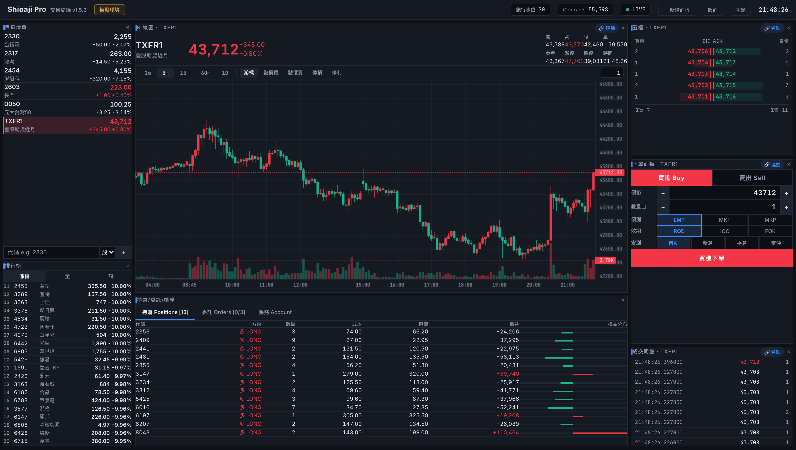
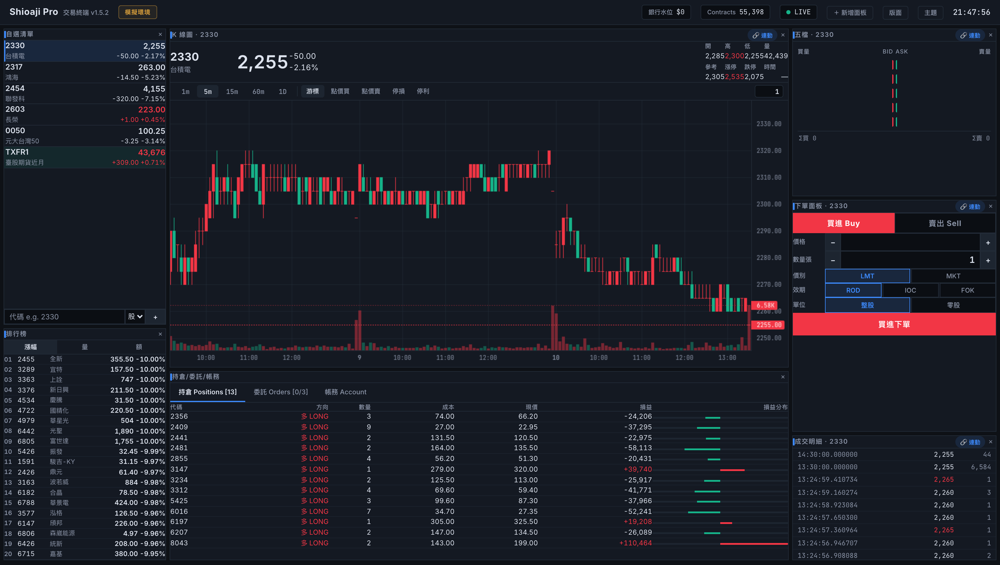
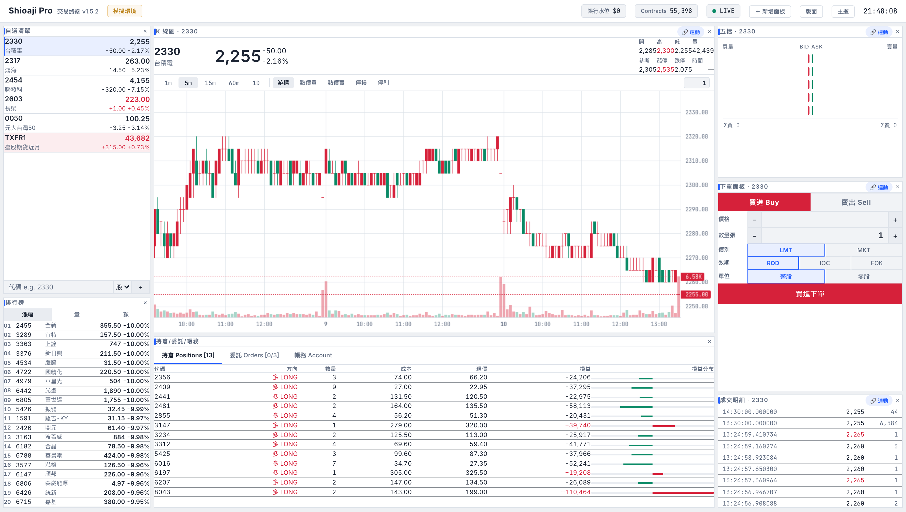

# Shioaji Pro — 專業交易終端 Trading Terminal

A professional, fully-customizable trading terminal for Taiwan markets
(TWSE / TPEX / TAIFEX), built on the [Shioaji](https://sinotrade.github.io/)
HTTP API + SSE streaming. React 19 + TypeScript + Vite, zero backend code —
it talks directly to your local `shioaji server`.

以 Shioaji HTTP API 打造的專業交易終端：即時行情、K 線、五檔、閃電下單、
圖表點價下單、停損停利觸價單、可拖拉的自訂版面。



## Features 功能

- **即時行情** — 單一 SSE 連線串流 tick / 五檔，自選清單成交閃動（只在真實成交時閃，試撮不閃）
- **K 線圖** — lightweight-charts，1m/5m/15m/60m/1D，即時 tick 更新當根 K 棒
  - **點價下單**：點圖表價位直接限價買賣
  - **停損 / 停利**：在圖上掛觸價單（觸價送市價單），虛線顯示、可取消
  - **委託管理**：未成交委託顯示為實線、overlay 有 CANCEL 按鈕、**拖曳委託線即改價**
  - **Hover 同步**：十字線價位即時同步到下單面板
- **閃電下單** — 價格梯點擊即下單（左欄買/右欄賣），含安全開關
- **五檔報價** — 量能條視覺化，點價帶入下單面板
- **成交明細** — 開啟即載入歷史 tick，時間精確到微秒
- **下單面板** — 整股/零股、ROD/IOC/FOK、期貨倉別，兩段式確認防誤觸
- **持倉 / 委託 / 帳務** — 即時損益、刪單、權益數與保證金
- **排行榜** — 漲幅 / 量 / 額 scanner，點擊即加入追蹤
- **自訂版面** — react-grid-layout 拖拉移動/縮放，面板可任意新增（多開 K 線圖）、
  每個面板可「連動自選」或「鎖定商品」，版面可命名儲存/載入
- **主題** — 深色 / 純黑 / 淺色 × 紅漲綠跌(台式) / 綠漲紅跌(美式)

| Dark | Light |
|------|-------|
|  |  |

## Getting Started 開始使用

### 1. Prerequisites 前置需求

- 永豐金證券帳戶 + Shioaji API Key/Secret
  （在 [API 管理頁](https://www.sinotrade.com.tw/newweb/PythonAPIKey/) 建立）
- [Node.js](https://nodejs.org/) 20+ 與 [pnpm](https://pnpm.io/)
- Shioaji CLI：

```sh
# 推薦用 uv 安裝
uv tool install shioaji
# 或下載 standalone binary，見 https://sinotrade.github.io/
```

### 2. Configure credentials 設定金鑰

```sh
cp .env.example .env
# 編輯 .env，填入你的 SJ_API_KEY / SJ_SEC_KEY
```

> `.env` 已被 `.gitignore` 排除，**請勿** commit 你的金鑰。

### 3. Start the Shioaji server 啟動行情/交易伺服器

```sh
shioaji server start          # 預設模擬環境（紙上交易）
shioaji server check          # 確認狀態
```

預設跑在 `http://127.0.0.1:8080`，**simulation 模式**——下單不會動用真錢。
切正式環境：`shioaji server start --production`（需先完成 CA 憑證設定，
請務必先在模擬環境完整測試）。

### 4. Run the app 啟動前端

```sh
pnpm install
pnpm dev
```

開啟 [http://localhost:5173](http://localhost:5173) —— dev server 會把
`/api` 代理到 `localhost:8080`。

## Deploy as a Shioaji custom app 部署為內建 App

Shioaji server 可直接代管前端，build 完上傳即可：

```sh
VITE_BASE=/apps/shioaji-pro-app/ pnpm build
cd dist
curl -X POST http://localhost:8080/api/v1/apps/shioaji-pro-app \
  -F "files=@index.html" \
  -F "files=@$(ls *.css)" \
  -F "files=@$(ls *.js)" \
  -F "files=@shioaji-logo.png"
```

然後開啟 `http://localhost:8080/apps/shioaji-pro-app/index.html`。
（注意：上傳的 app 存在 server 記憶體，server 重啟後需重新上傳。）

## Safety notes 安全提醒

- 預設為**模擬環境**；頂部會顯示「模擬環境」徽章，正式環境為紅色「正式環境」
- 閃電下單預設**鎖定**，需手動啟用；圖表點價下單為 one-shot 模式
- 停損/停利為**客戶端觸價單**，只在頁面開啟時監控
- 正式環境的每一筆委託都是真實交易，請自行承擔風險

## Stack

- React 19 + TypeScript + Vite 8
- [vanilla-extract](https://vanilla-extract.style/) — zero-runtime themable CSS
- [lightweight-charts](https://tradingview.github.io/lightweight-charts/) v5
- [react-grid-layout](https://github.com/react-grid-layout/react-grid-layout) v2
- Shioaji HTTP API + Server-Sent Events

## License

MIT
